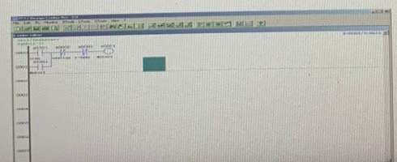
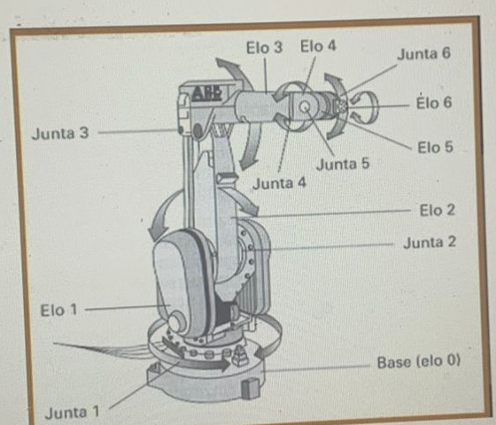

**Notas:** Adicionei imagens as anotações a título de estudo.

# Anotações - Exame Final (Automação e Controle)

**Questão 1:** Com base nas discussões em sala, o que se compreende pelo termo manufatura, traçando um paralelo entre o significado original/histórico da palavra e a sua realidade atual?

**Questão 2:** Considerando as abordagens vistas na disciplina, elabore uma análise comparativa do CIM (Computer Integrated Manufacture) sob a ótica do "Modelo em Y" e do "Modelo em Roda".

**Questão 3:** Descreva a diferença conceitual entre engenharia sequencial e engenharia simultânea.

**Questão 4:** Diferencie a representação de modelos sólidos utilizando CSG (Geometria Sólida Construtiva) e B-Rep (Representação por Limites) em aplicações CAD 3D.

**Questão 5:** Qual é a finalidade e a função prática de um pós-processador dentro de um ambiente CAM?

**Questão 6:** Qual(is) tipo(s) de Sistema(s) CAE seria(m) recomendado(s) para atuar de forma principal em uma indústria focada em moldes de injeção de plásticos? Apresente uma justificativa para a sua escolha.

**Questão 7:** Quais são as características primárias que definem um sistema CAPP do tipo Generativo?

**Questão 8:** Estabeleça as diferenças de operação entre uma máquina CNC de 2,5 eixos e uma máquina CNC de 3 eixos, comentando também sobre as restrições e limitações de cada modelo.

**Questão 9:** Quais são as distinções fundamentais entre as normas IGES e STEP (ISO 10303) quando são utilizadas no intercâmbio de dados de projetos e produtos?

**Questão 10:** De acordo com a lógica apresentada na linguagem Ladder para um CLP, explique como ocorre o seu funcionamento e identifique todas as variáveis de entrada e de saída.

**Questão 11:** Explique as diferenças conceituais entre as características de PRECISÃO e EXATIDÃO quando aplicadas à especificação de equipamentos de Automação Industrial.

**Questão 12:** Defina o que o termo HISTERESE significa no contexto das propriedades e características de sensores de posição.

**Questão 13:** Quantos graus de liberdade (DOF) possui o manipulador/robô ilustrado na figura a seguir?

