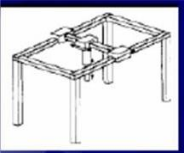
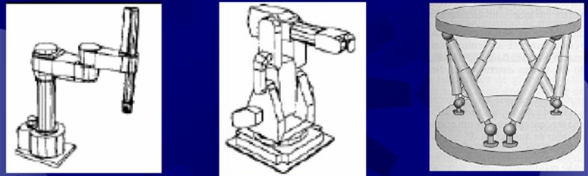

# Anotações - Prova 2 (Automação e Controle)
*1º Semestre 2015*

**Questão 1:** Explique a diferença entre a representações em Wireframe, sólidos em CSG e sólidos em B-Rep (Superfícies limitantes) usados em CAD 3D. 

**Questão 2:** Qual o tipo de sistema CAPP você recomendaria a uma empresa que produz produtos mecânicos em pequena quantidade e com uma variabilidade grande do tipo de produto? Justifique a resposta. 

**Questão 3:** Cite três vantagens e três desvantagens no uso de sistemas CAE. 

**Questão 4:** Qual a utilidade dos pós-processadores em um sistema CAM?

**Questão 5:** Explique a diferença, se existir, entre sensor e transdutor. 

**Questão 6:** O que se entende por engenharia simultânea?

**Questão 7:** Com base no visto em aulas faça uma análise comparando as visões de CIM (Computer Integrated Manufacture) segundo o modelo em "Y" e o Modelo em Roda. 

**Questão 8:** Quando falamos em B-Rep (Superfícies limitantes) foram citadas em aula cinco condições mínimas que as superfícies do sólido devem atender para garantir este tipo de representação. Cite ao menos quatro. *(Lembrando alguns contra-exemplos: garrafa de Klein e fita de Möbius)*. 

**Questão 9:** Das linguagens citadas abaixo, marque a(s) que é(são) adequada(s) a CLP.
- ( ) SET
- ( ) VDI
- ( ) PDDI
- ( ) STL
- ( ) IGES
- ( ) Ladder

**Questão 10:** Quais as principais diferenças entre as Normas IGES e STEP (ISO 10303) quando usadas para intercâmbio de dados de produtos? 

**Questão 11:** Qual a diferença da mudança causada por evento e uma mudança causada por tempo no controle discreto?

**Questão 12:** Qual a diferença da operação de um motor de passo convencional e um motor CA ou CC?

**Questão 13:** Em um robô, explique o que é: Elo, Junta e Espaço de Trabalho. 

**Questão 14:** Dada a figura abaixo indique o tipo de robô escrevendo a letra na opção correspondente.

A, B, C, D
- ( ) Articulado (Antropomórfico)
- ( ) SCARA
- ( ) Paralelo
- ( ) Cartesiano
