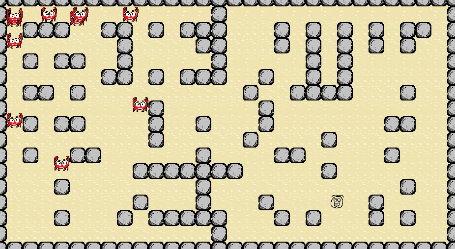

# Lecrab

Um jogo simples para estudar rotas com grafos em jogos.

Atualizado em 13/out/2025 por Herton Silveira e Mariana do Santos (100% da Mari) para que os Enemies utilizem um algoritmo guloso para encontrar o jogador P1.
