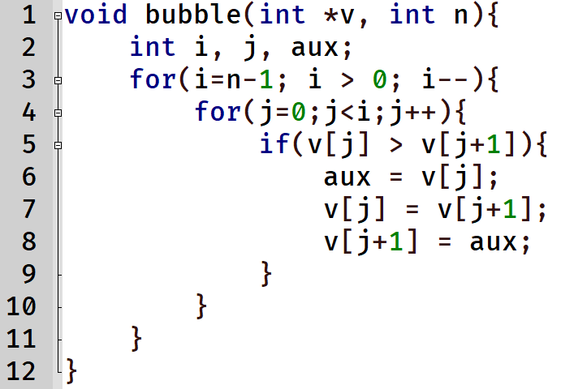
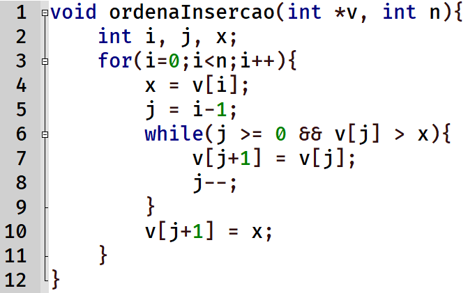

# Algoritmos de Ordenação

### Ordenação Bubble Sort

A ordenação *Bubble Sort* é uma abordagem clássica apresentada nos estudos de complexidade. A imagem acima ilustra o mecanismo de funcionamento e análise desse algoritmo.

#### Exercícios de Análise de Complexidade

Para o algoritmo *Bubble Sort*, devem ser respondidas as seguintes questões propostas para reflexão e estudo:
- Qual é o **pior caso** do algoritmo?
- Qual é o **melhor caso**? *(Atenção: O melhor caso não é linear na implementação mais simples. Por quê isso ocorre e como é possível melhorar o algoritmo para que o melhor caso se torne linear?)*

### Ordenação por Inserção (Insertion Sort)

A imagem acima apresenta a estrutura, o funcionamento e possivelmente o pseudocódigo do algoritmo de Ordenação por Inserção (*Insertion Sort*). O slide é proposto como um **Exercício** para aplicação prática da análise de complexidade.
