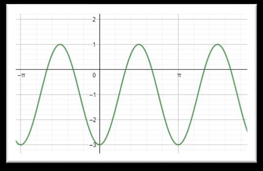
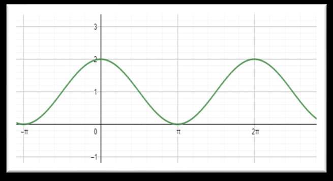
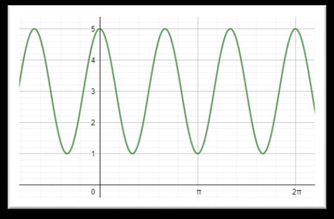
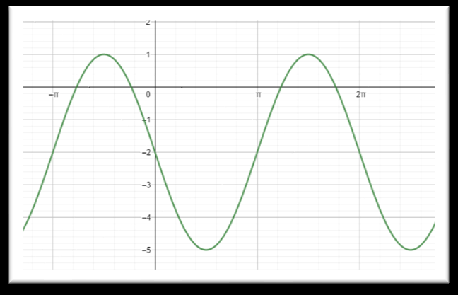
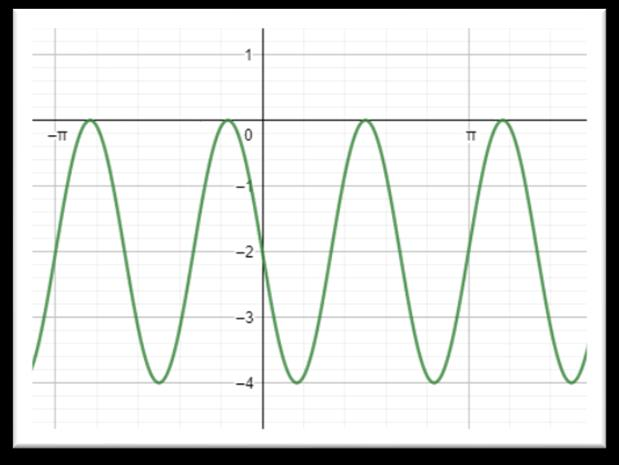
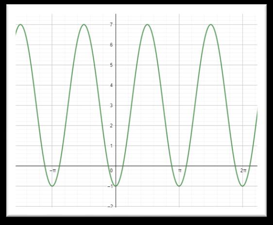

# 3ª Lista de Exercícios: Funções Trigonométricas

> [!NOTE]
> **Informações Acadêmicas:**
> - **Curso Superior:** Bacharelado em Ciência da Computação (UDESC)
> - **Disciplina:** Introdução ao Cálculo Diferencial e Integral (ICD)
> - **Professor:** Dani Prestini
> - **Data:** 06/07/2022

---

## 1. Análise e Esboço de Funções Trigonométricas

### Questão 1
Esboce o gráfico das funções trigonométricas, e determine o período ($T$), amplitude ($A$), domínio ($D(f)$) e imagem ($Im(f)$) das seguintes funções:

*   **a)** $y = 2 + \sin x$
    *   **Período ($T$):** $2\pi$
    *   **Amplitude ($A$):** $1$
    *   **Domínio ($D(f)$):** $\mathbb{R}$
    *   **Imagem ($Im(f)$):** $[1, 3]$

*   **b)** $y = 2 \sin 4x$
    *   **Período ($T$):** $\frac{\pi}{2}$
    *   **Amplitude ($A$):** $2$
    *   **Domínio ($D(f)$):** $\mathbb{R}$
    *   **Imagem ($Im(f)$):** $[-2, 2]$

*   **c)** $y = -3 \cos(0,5x)$
    *   **Período ($T$):** $4\pi$
    *   **Amplitude ($A$):** $3$
    *   **Domínio ($D(f)$):** $\mathbb{R}$
    *   **Imagem ($Im(f)$):** $[-3, 3]$

*   **d)** $y = 3 \sin 2\pi x$
    *   **Período ($T$):** $1$
    *   **Amplitude ($A$):** $3$
    *   **Domínio ($D(f)$):** $\mathbb{R}$
    *   **Imagem ($Im(f)$):** $[-3, 3]$

*   **e)** $y = 3 \cos\left(2x + \frac{\pi}{2}\right)$
    *   **Período ($T$):** $\pi$
    *   **Amplitude ($A$):** $3$
    *   **Domínio ($D(f)$):** $\mathbb{R}$
    *   **Imagem ($Im(f)$):** $[-3, 3]$

---

### Questão 1 (Funções Tangentes)
Esboce o gráfico das funções trigonométricas, e determine o período ($T$), domínio ($D(f)$) e imagem ($Im(f)$) das funções tangentes:

*   **a)** $y = \tan(2x) + 1$
    *   **Período ($T$):** $\frac{\pi}{2}$
    *   **Domínio ($D(f)$):** $\left\{x \in \mathbb{R} \;\middle|\; x \neq \frac{\pi}{4} + \frac{k\pi}{2}; k \in \mathbb{Z}\right\}$
    *   **Imagem ($Im(f)$):** $\mathbb{R}$

*   **b)** $y = 2 \tan(3x)$
    *   **Período ($T$):** $\frac{\pi}{3}$
    *   **Domínio ($D(f)$):** $\left\{x \in \mathbb{R} \;\middle|\; x \neq \frac{\pi}{6} + \frac{k\pi}{3}; k \in \mathbb{Z}\right\}$
    *   **Imagem ($Im(f)$):** $\mathbb{R}$

---

## 2. Identificação de Funções por Gráficos

### Questão 2
Analise os gráficos abaixo e encontre a função trigonométrica correspondente:

#### **a)**

*   **Função:** $y = 2\sin(4x) - 1$

#### **b)**

*   **Função:** $y = \cos x + 1$

#### **c)**

*   **Função:** $y = 3 - 2\sin(4x)$

#### **d)**

*   **Função:** $y = -2 - 3\sin(2x)$

#### **e)**

*   **Função:** $y = 3 + 4\cos(3x)$

#### **f)**

*   **Função:** $y = 2\cos(4x) - 2$
