# Funções e suas Propriedades

Este documento apresenta os conceitos fundamentais sobre funções matemáticas, suas propriedades, características e análises gráficas, conforme os slides da disciplina de Introdução ao Cálculo Diferencial e Integral (ICD).

---

## Definição de Função e Notação

Uma função é uma relação entre dois conjuntos que associa a cada elemento do primeiro conjunto (domínio) exatamente um elemento do segundo conjunto (contradomínio).

### Exemplo 1
A fórmula $y = x^2$ define $y$ como uma função de $x$?

**Resolução:**
Sim, pois para cada valor real atribuído a $x$, o quadrado deste número é único, resultando em um único valor correspondente de $y$.

### Exemplo 2
Dos três gráficos mostrados na figura abaixo, qual deles não é gráfico de uma função? Como podemos explicar?

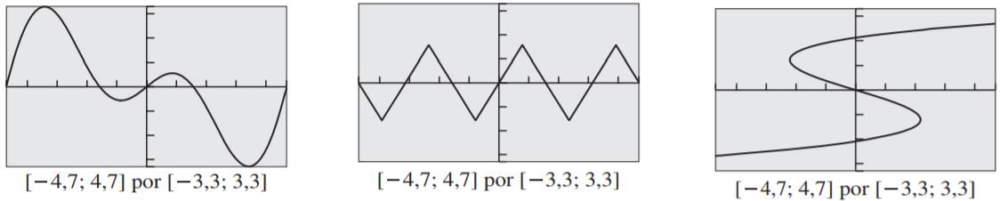

**Resolução:**
Utiliza-se o Teste da Reta Vertical: Se for possível traçar uma reta vertical que intercepte o gráfico em mais de um ponto, o gráfico não representa uma função. 

---

## Domínio e Imagem

O **domínio** de uma função é o conjunto de todos os valores possíveis de entrada (valores de $x$) para os quais a função está definida. A **imagem** é o conjunto de todos os valores de saída (valores de $y$) resultantes da aplicação da função aos elementos do domínio.

### Exemplo 3
Encontre o domínio de cada função:

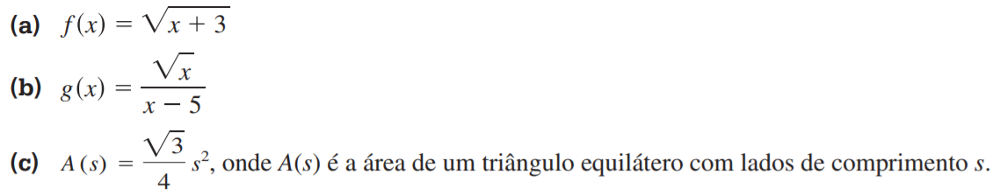
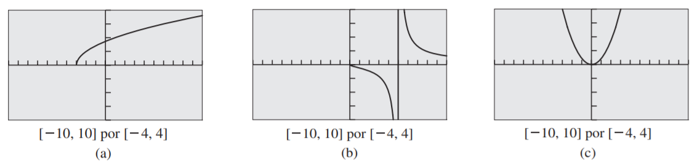

### Exemplo 4
Encontre a imagem da função $f(x) = \frac{2}{x}$.

**Resolução:**
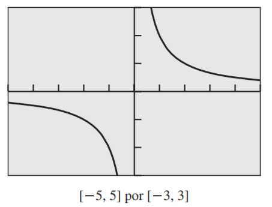

A função $f(x) = \frac{2}{x}$ não está definida para $x = 0$. Como o numerador é uma constante não nula, a fração nunca será zero. Portanto, a imagem inclui todos os valores reais, exceto o 0.

---

## Continuidade de uma função

Graficamente falando, diz-se que uma função é contínua em um ponto se o gráfico não apresenta falha (do tipo “quebra”, “pulo” etc.). Essa é uma das mais importantes propriedades da maioria das funções. Podemos ilustrar o conceito com exemplos de gráficos.

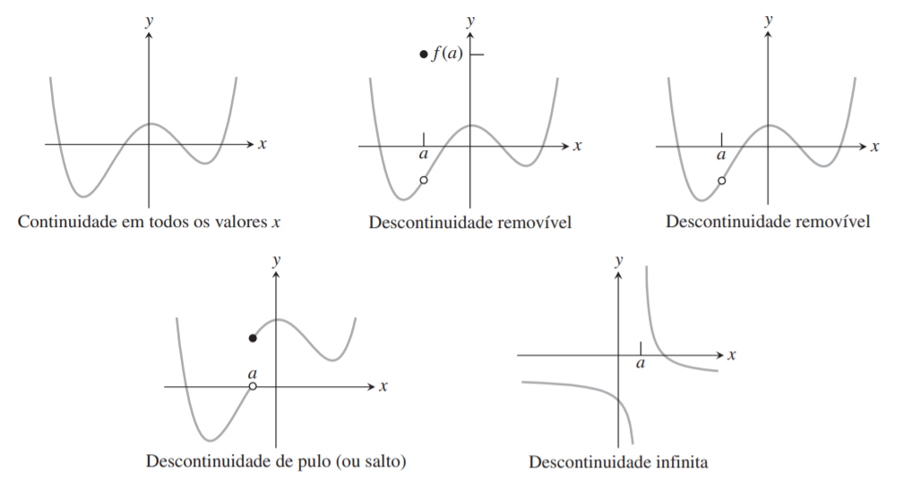

### Exemplo 5
Analise os gráficos e verifique qual das seguintes figuras mostra funções descontínuas em $x = 2$. Indique se a descontinuidade apresentada é do tipo removível.

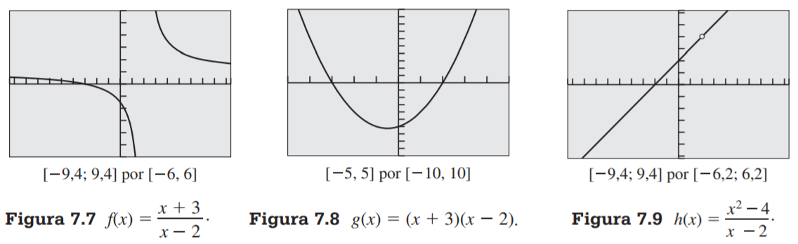

---

## Funções Crescentes e Decrescentes

Outro conceito de função, fácil de entender graficamente, é a propriedade de ser crescente, decrescente ou constante sobre um intervalo. Ilustramos o conceito com alguns exemplos de gráficos:

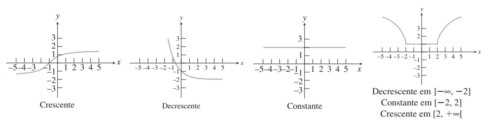

### Exemplo 6
Das três tabelas de dados numéricos abaixo, qual poderia ser modelada por uma função que seja (a) crescente, (b) decrescente ou (c) constante?

### Exemplo 8
Para cada caso, verifique se a função é crescente ou decrescente em cada um dos seus intervalos.

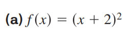
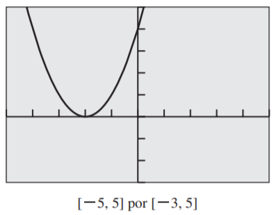
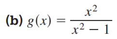
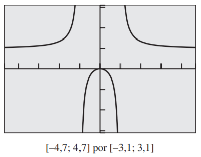

---

## Funções Limitadas

O conceito de função limitada é simples de entender, tanto gráfica como algebricamente. Uma função pode ser limitada inferiormente, superiormente, ou ambas.

### Exemplo 9
Identifique se cada função é limitada inferiormente, limitada superiormente ou limitada.

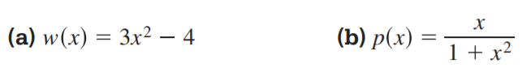
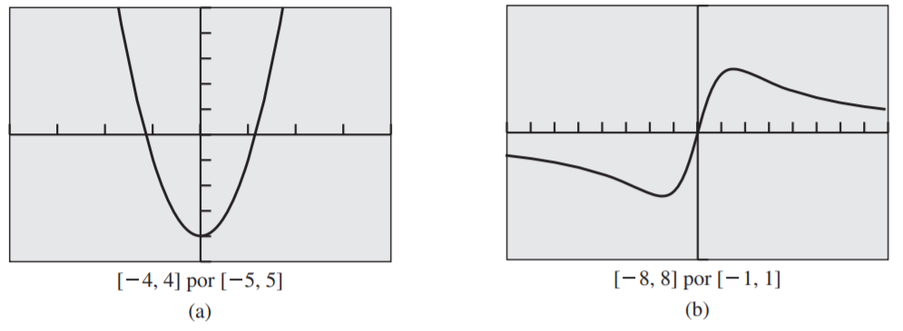

---

## Extremo Local e Extremo Absoluto

Os pontos onde o gráfico da função atinge "picos" ou "vales" representam máximos e mínimos locais, respectivamente. O maior valor possível da função em todo o domínio é o máximo absoluto, e o menor é o mínimo absoluto.

### Exemplo 10
Verifique se $f(x) = x^4 - 7x^2 + 6x$ tem máximo local ou mínimo local. Caso isso se confirme, encontre cada valor máximo ou mínimo local, e o respectivo valor de $x$.

---

## Simetria

A simetria em funções ajuda a entender suas propriedades de forma gráfica e algébrica.

### Simetria com relação ao eixo vertical y (Função Par)
Dizemos que uma função é par se para todo $x$ em seu domínio, tivermos $f(-x) = f(x)$.

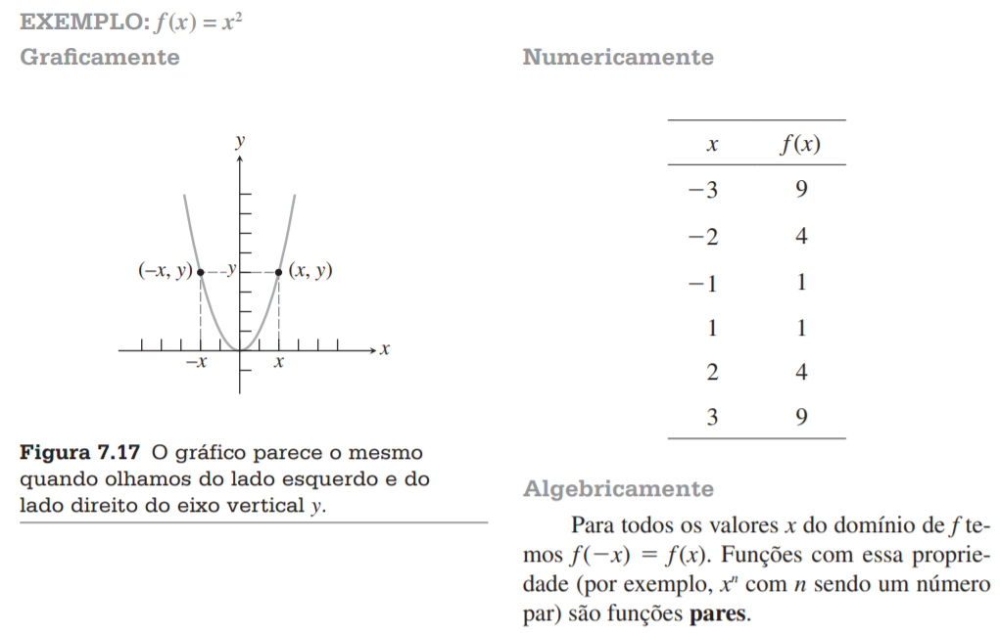

### Simetria com relação ao eixo horizontal x
Uma relação não pode ser uma função e ser simétrica em relação ao eixo x simultaneamente (exceto $f(x)=0$), mas algumas curvas são. Isso ocorre quando $(x,-y)$ pertence à curva se $(x,y)$ pertence.

### Simetria com relação à origem (Função Ímpar)
Dizemos que uma função é ímpar se para todo $x$ em seu domínio, tivermos $f(-x) = -f(x)$.

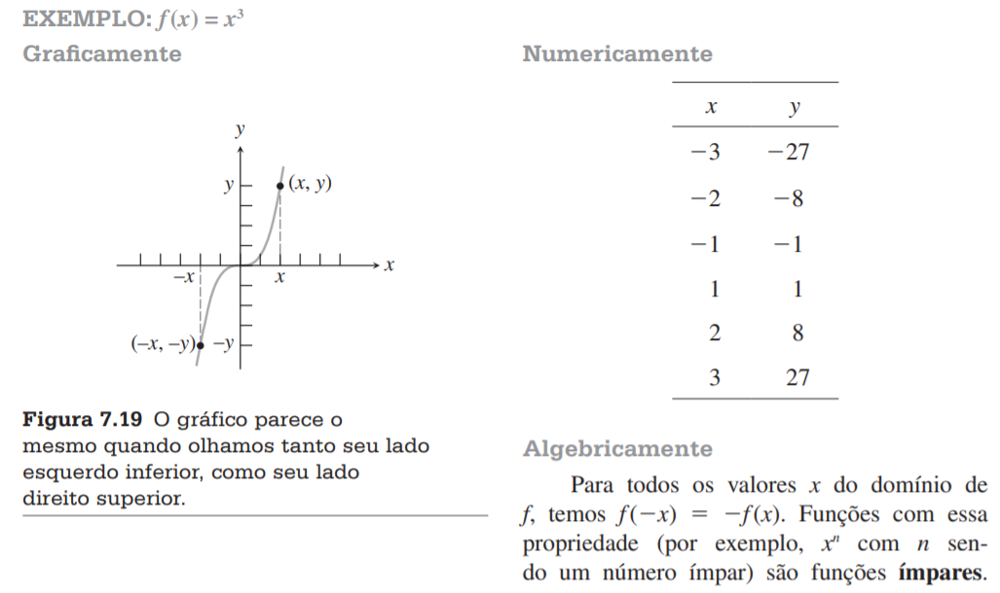

---

## Exercícios
1) Livro Texto: páginas 88 à 92 – Exercícios do 1 ao 54 e Exercícios do 73 ao 83.
