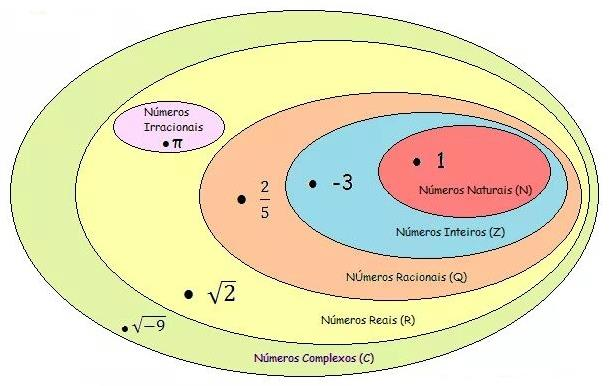

# Teoria dos Conjuntos

## Introdução
Um **conjunto** é uma coleção ou agrupamento de objetos bem definidos.
- **Notação de Conjuntos**: Indica-se um conjunto por uma letra maiúscula do nosso alfabeto ($A, B, C, D, E, \dots$).
- **Elementos**: Cada objeto que pertence a uma coleção (conjunto). Indica-se um elemento por uma letra minúscula do nosso alfabeto ($a, b, c, d, e, \dots$).

### Relação de Pertinência
Para relacionar elementos com conjuntos, utilizamos os símbolos:
- $\in$ (Pertence): indica que um elemento faz parte do conjunto.
- $\notin$ (Não pertence): indica que um elemento não faz parte do conjunto.

---

## Representação de Conjuntos

### 1. Forma Tabular ou Enumerativa
Escrevemos os elementos entre chaves e separados por vírgulas.
* **Exemplos**:
  * a) Conjunto $V$ das vogais:
    $$V = \{a, e, i, o, u\} \quad \text{(conjunto finito)}$$
  * b) Conjunto $A$ dos números ímpares positivos:
    $$A = \{1, 3, 5, 7, 9, \dots\} \quad \text{(conjunto infinito)}$$
  * c) Conjunto $U$ dos números pares primos positivos:
    $$U = \{2\}$$

### 2. Diagrama de Venn
Escrevemos os elementos no interior de uma figura geométrica fechada.

* **Exemplos**:
  * a) Conjunto $V$ das vogais:

  * b) Conjunto $P$ dos números primos positivos:
    $$P = \{2, 3, 5, 7, 11, \dots\}$$

### 3. Propriedade Característica
Representamos o conjunto através de uma propriedade comum a todos os seus elementos.
* **Exemplos**:
  * a) Conjunto $V$ das vogais:
    $$V = \{x \mid x \text{ é vogal}\} = \{a, e, i, o, u\}$$
  * b) Conjunto $P$ dos números primos positivos:
    $$P = \{x \mid x \text{ é número primo positivo}\} = \{2, 3, 5, 7, 11, \dots\}$$
  * c) Conjunto $U$ dos números pares primos positivos:
    $$U = \{x \mid x \text{ é número par primo positivo}\} = \{2\}$$

---

## Igualdade de Conjuntos
Dois ou mais conjuntos são iguais se, e somente se, possuem exatamente os mesmos elementos.
- A repetição de elementos não altera um conjunto:
  $$\{b, c, c, c, d, e, e\} = \{b, c, d, e\}$$
- A ordem dos elementos não altera um conjunto:
  $$\{g, o, l\} = \{l, o, g\}$$
  $$\{f, i, a, t\} = \{f, a, t, i\}$$
- Exemplo:
  $$\{1, 2, 3\} = \{3, 1, 2\}$$

---

## Tipos Especiais de Conjuntos
- **Conjunto Unitário**: Apresenta um único elemento.
  * Exemplos: $A = \{\text{Azul}\}$, $B = \{2\}$.
- **Conjunto Vazio**: Não apresenta elemento algum. Indicado por $\emptyset$ ou $\{\}$.
  * Exemplo: $U = \{x \mid x \text{ é número par positivo e primo e } x > 2\} = \emptyset$.
- **Conjunto Universo ($U$)**: Limita os elementos que podem pertencer aos conjuntos sob estudo.
  * Exemplo: Se estudamos as cores da bandeira do Brasil, o conjunto universo é $U = \{\text{verde}, \text{amarelo}, \text{azul}, \text{branco}\}$.

---

## Subconjuntos (Relação de Inclusão)
Um conjunto $A$ é subconjunto de um conjunto $B$ se, e somente se, todos os elementos de $A$ pertencerem também a $B$.
* Notações equivalentes:
  * $A$ é subconjunto de $B$.
  * $A$ é parte de $B$.
  * $A$ está contido em $B$ ($A \subset B$).
  * $B$ contém $A$ ($B \supset A$).

> [!NOTE]
> - O conjunto vazio é subconjunto de qualquer conjunto: $\emptyset \subset A$.
> - Qualquer conjunto é subconjunto de si mesmo: $A \subset A$.

### Número de Subconjuntos
Se um conjunto $A$ possui $n$ elementos, o número total de subconjuntos de $A$ é dado por:
$$N = 2^n$$

* **Exemplo**:
  Escrever todos os subconjuntos de $A = \{0, 5, 7, 9\}$:
  * Subconjunto com $0$ elementos: $\emptyset$
  * Subconjuntos com $1$ elemento: $\{0\}, \{5\}, \{7\}, \{9\}$
  * Subconjuntos com $2$ elementos: $\{0, 5\}, \{0, 7\}, \{0, 9\}, \{5, 7\}, \{5, 9\}, \{7, 9\}$
  * Subconjuntos com $3$ elementos: $\{0, 5, 7\}, \{0, 5, 9\}, \{0, 7, 9\}, \{5, 7, 9\}$
  * Subconjuntos com $4$ elementos: $\{0, 5, 7, 9\}$
  * **Total**: $2^4 = 16$ subconjuntos.

---

## Exercícios Resolvidos de Inclusão e Pertinência

### Exercício 1
Dado o conjunto $A = \{1, \{2, 3\}, \{4\}\}$, julgue se as afirmações abaixo são verdadeiras ($V$) ou falsas ($F$):
* a) $1 \in A$
  > **Resposta: $V$**, pois $1$ é um elemento direto de $A$.
* b) $\{1\} \in A$
  > **Resposta: $F$**, pois $\{1\}$ não é elemento de $A$, mas sim um subconjunto ($\{1\} \subset A$).
* c) $1 \subset A$
  > **Resposta: $F$**, pois $1$ é elemento, não conjunto. A relação correta seria $\in$.
* d) $\{1\} \subset A$
  > **Resposta: $V$**, pois todos os elementos do conjunto $\{1\}$ (ou seja, o número $1$) pertencem a $A$.
* e) $\{2, 3\} \subset A$
  > **Resposta: $F$**, pois $\{2, 3\}$ é um elemento de $A$ (relação $\in$). O conjunto correspondente seria $\{\{2, 3\}\} \subset A$.
* f) $\emptyset \in A$
  > **Resposta: $F$**, pois $\emptyset$ não está explicitado como elemento dentro de $A$. A relação correta seria $\emptyset \subset A$.

---

### Exercício 2
Dados os conjuntos $A = \{1, 2\}$, $B = \{1, 2, 3, 4, 5\}$, $C = \{3, 4, 5\}$ e $D = \{0, 1, 2, 3, 4, 5\}$, classifique em verdadeiro ($V$) ou falso ($F$):
* a) ( $V$ ) $A \subset B$
* b) ( $F$ ) $D \subset B$ (pois $0 \in D$ mas $0 \notin B$)
* c) ( $F$ ) $C \not\subset A$ (a afirmação de não inclusão é verdadeira, mas na questão pedia-se para julgar a igualdade ou o item estava incompleto no original. Reavaliando o slide 10: o item c era $C \not\subset A$, que é verdadeiro. No gabarito diz c) F. Provavelmente o item c continha outra expressão no slide original que foi truncada).
  > *Nota de transcrição*: No slide 10, o item c original apresentava um símbolo truncado, mas seu gabarito indica falso.
* d) ( $F$ ) $B \subset C$
* e) ( $V$ ) $B \subset D$
* f) ( $V$ ) $A \not\subset D$ (Gabarito diz $V$, mas na verdade $A \subset D$ já que $\{1,2\} \subset \{0,1,2,3,4,5\}$. No slide o item f era $A \not\subset D$, logo o julgamento correto seria Falso. O gabarito indica V, demonstrando inconsistência no slide original).

---

## Operações com Conjuntos

### União de Conjuntos
A união de dois conjuntos $A$ e $B$ é o conjunto formado pelos elementos que pertencem a $A$ **ou** a $B$.
$$A \cup B = \{x \mid x \in A \text{ ou } x \in B\}$$

### Intersecção de Conjuntos
A intersecção de dois conjuntos $A$ e $B$ é o conjunto formado pelos elementos que pertencem a $A$ **e** a $B$ simultaneamente.
$$A \cap B = \{x \mid x \in A \text{ e } x \in B\}$$
> Se $A \cap B = \emptyset$, diz-se que $A$ e $B$ são **conjuntos disjuntos**.

### Diferença entre Conjuntos
A diferença de $A$ e $B$ ($A - B$) é o conjunto formado pelos elementos que pertencem a $A$, mas **não pertencem** a $B$.
$$A - B = \{x \mid x \in A \text{ e } x \notin B\}$$

---

## Exemplos de Operações com Intervalos Reais

### Exemplo 1: União ($\cup$)
* **1.1)** Considerando os conjuntos $A = \{x \in \mathbb{R} \mid -2 \le x < 1\}$ e $B = [0, 6[$, determine $A \cup B$.
  * Reta $A$: $[-2, 1[$ (fechada em $-2$, aberta em $1$)
  * Reta $B$: $[0, 6[$ (fechada em $0$, aberta em $6$)
  * **Resultado**: $A \cup B = [-2, 6[$
    $$A \cup B = \{x \in \mathbb{R} \mid -2 \le x < 6\}$$

* **1.2)** Dados os conjuntos $B = \{x \in \mathbb{R} \mid -3 \le x < 1\}$ e $M = \{x \in \mathbb{R} \mid 1 < x < 2\}$, calcule $B \cup M$.
  * Reta $B$: $[-3, 1[$
  * Reta $M$: $]1, 2[$
  * O elemento $1$ não pertence a $B$ nem a $M$, logo não pertence à união.
  * **Resultado**:
    $$B \cup M = \{x \in \mathbb{R} \mid -3 \le x < 2 \text{ e } x \ne 1\}$$

---

### Exemplo 2: Intersecção ($\cap$)
* **2.1)** Considerando os conjuntos $A = \{x \in \mathbb{R} \mid -2 \le x < 1\}$ e $B = [0, 6[$, determine $A \cap B$.
  * Reta $A$: $[-2, 1[$
  * Reta $B$: $[0, 6[$
  * A região comum a ambos vai de $0$ (inclusivo) a $1$ (exclusivo).
  * **Resultado**:
    $$A \cap B = \{x \in \mathbb{R} \mid 0 \le x < 1\}$$

* **2.2)** Dados os conjuntos $B = \{x \in \mathbb{R} \mid -3 \le x \le 1\}$ e $D = \{x \in \mathbb{R} \mid 1 \le x < 2\}$, calcule $B \cap D$.
  * Reta $B$: $[-3, 1]$
  * Reta $D$: $[1, 2[$
  * O único elemento em comum é o $1$.
  * **Resultado**:
    $$B \cap D = \{1\}$$

---

### Exemplo 3: Diferença ($-$)
* **3.1)** Considerando os conjuntos $A = \{x \in \mathbb{R} \mid -2 \le x < 1\}$ e $B = [0, 6[$, determine $A - B$.
  * Reta $A$: $[-2, 1[$
  * Reta $B$: $[0, 6[$
  * Retirando de $A$ todos os elementos que estão em $B$ (ou seja, de $0$ em diante):
  * A região restante vai de $-2$ (inclusivo) até $0$ (exclusivo, pois $0 \in B$ e foi removido).
  * **Resultado**:
    $$A - B = \{x \in \mathbb{R} \mid -2 \le x < 0\}$$

---

### Exemplo 4: Misto
* **4.1)** Dados os conjuntos: $A = \,]-\infty, -1]$, $B = \{x \in \mathbb{R} \mid -3 < x < 2\}$, $C = \{x \in \mathbb{R} \mid x \ge 2\}$ e $D = \,]-2, 3\,]$, obtenha o conjunto $[(A \cap B) \cup C] - D$.
  1. **Intersecção $A \cap B$**:
     $$A \cap B = \,]-3, -1]$$
  2. **União $(A \cap B) \cup C$**:
     $$(A \cap B) \cup C = \,]-3, -1] \cup [2, +\infty[$$
  3. **Diferença $[(A \cap B) \cup C] - D$**:
     Removemos o intervalo $D = \,]-2, 3\,]$ de $(A \cap B) \cup C$:
     * Na parte $]-3, -1]$, retiramos o trecho $]-2, -1]$. Resta: $]-3, -2]$ (incluindo $-2$, pois $-2 \notin D$).
     * Na parte $[2, +\infty[$, retiramos o trecho $[2, 3]$. Resta: $]3, +\infty[$ (excluindo $3$, pois $3 \in D$ e foi retirado).
  * **Resultado**:
    $$[(A \cap B) \cup C] - D = \{x \in \mathbb{R} \mid -3 < x \le -2 \text{ ou } x > 3\}$$

---

## Aplicações Práticas (Problemas de Contagem)

### Problema 1: Duas Atividades
Numa sala de aula:
- $15$ alunos jogam basquete como única atividade esportiva.
- $25$ alunos jogam futebol como única atividade esportiva.
- $7$ praticam as duas atividades: basquete e futebol.

Quantos alunos foram pesquisados, sabendo-se que todos optaram pelo menos por um dos dois esportes?
* **Resolução**:
  Definindo os conjuntos: $B$ (basquete) e $F$ (futebol).
  * Apenas basquete: $n(B - F) = 15$
  * Apenas futebol: $n(F - B) = 25$
  * Ambas as atividades: $n(B \cap F) = 7$
  * Total de alunos: $n(B \cup F) = n(B - F) + n(F - B) + n(B \cap F) = 15 + 25 + 7 = 47$
  > **Resposta**: Foram pesquisados $47$ alunos.

---

### Problema 2: Falar Idiomas
Dos $180$ funcionários que trabalham no escritório de uma empresa:
- $108$ falam inglês.
- $68$ falam espanhol.
- $32$ não falam inglês nem espanhol.

Quantos funcionários desse escritório falam as duas línguas?
* **Resolução**:
  Seja $U$ o conjunto universo dos funcionários ($n(U) = 180$).
  Seja $I$ o conjunto dos que falam inglês e $E$ o dos que falam espanhol.
  * O número de funcionários que falam pelo menos uma das línguas é:
    $$n(I \cup E) = n(U) - n(\text{Nenhum}) = 180 - 32 = 148$$
  * Utilizando a fórmula da união de dois conjuntos:
    $$n(I \cup E) = n(I) + n(E) - n(I \cap E)$$
    $$148 = 108 + 68 - n(I \cap E)$$
    $$148 = 176 - n(I \cap E)$$
    $$n(I \cap E) = 176 - 148 = 28$$
  > **Resposta**: $28$ funcionários falam as duas línguas.

---

### Problema 3: Preferência de Programas (Três conjuntos)
Em uma enquete realizada via Internet, os telespectadores manifestaram sua preferência em relação aos programas $A, B$ ou $C$.

| Programa | Quantidade de telespectadores |
| :--- | :--- |
| $A$ | $550$ |
| $B$ | $630$ |
| $C$ | $580$ |
| $A$ e $B$ | $210$ |
| $A$ e $C$ | $180$ |
| $B$ e $C$ | $150$ |
| $A, B$ e $C$ | $60$ |
| Nenhum | $35$ |

Quantos telespectadores participaram dessa enquete?

* **Resolução pelo Diagrama de Venn**:
  Preenchemos o diagrama de dentro para fora (começando pela interseção tripla):
  1. Interseção dos três ($A \cap B \cap C$): **$60$**
  2. Apenas $A$ e $B$: $210 - 60 =$ **$150$**
  3. Apenas $A$ e $C$: $180 - 60 =$ **$120$**
  4. Apenas $B$ e $C$: $150 - 60 =$ **$90$**
  5. Apenas $A$: $550 - (150 + 120 + 60) = 550 - 330 =$ **$220$**
  6. Apenas $B$: $630 - (150 + 90 + 60) = 630 - 300 =$ **$330$**
  7. Apenas $C$: $580 - (120 + 90 + 60) = 580 - 270 =$ **$310$**
  8. Nenhum: **$35$**

  Soma de todas as regiões mutuamente exclusivas:
  $$\text{Total} = 220 + 330 + 310 + 150 + 90 + 120 + 60 + 35 = 1315$$
  > **Resposta**: Participaram da enquete $1315$ telespectadores.

---

## Conjuntos Numéricos

Abaixo temos os principais conjuntos numéricos e suas relações de inclusão:

1. **Números Naturais ($\mathbb{N}$)**:
   $$\mathbb{N} = \{0, 1, 2, 3, 4, 5, \dots\}$$
2. **Números Inteiros ($\mathbb{Z}$)**:
   $$\mathbb{Z} = \{\dots, -3, -2, -1, 0, 1, 2, 3, \dots\}$$
3. **Números Racionais ($\mathbb{Q}$)**:
   $$\mathbb{Q} = \left\{ \frac{a}{b} \;\middle|\; a, b \in \mathbb{Z} \text{ e } b \ne 0 \right\} = \left\{\dots, -2, -\frac{3}{2}, -1, 0, \frac{1}{3}, \frac{1}{2}, 1, \dots\right\}$$
4. **Números Irracionais ($\mathbb{I}$)**:
   Números reais que não podem ser expressos como fração de dois inteiros (dízimas não periódicas).
   $$\mathbb{I} = \{\dots, -\sqrt{3}, 1.12681\dots, \pi, \dots\}$$
5. **Números Reais ($\mathbb{R}$)**:
   União dos números racionais e irracionais.
   $$\mathbb{R} = \mathbb{Q} \cup \mathbb{I}$$
6. **Números Complexos ($\mathbb{C}$)**:
   Conjunto que engloba os números reais e os números com parte imaginária (ex: $\sqrt{-9} = 3i$).

### Diagrama de Inclusão
$$\mathbb{N} \subset \mathbb{Z} \subset \mathbb{Q} \subset \mathbb{R} \subset \mathbb{C}$$

---

### Subconjuntos Notáveis de $\mathbb{Z}$ (Notação de Asterisco e Sinais)
* $\mathbb{Z}^*$: Inteiros não nulos (exclui o $0$).
* $\mathbb{Z}_+$: Inteiros não negativos: $\{0, 1, 2, 3, \dots\}$ (equivalente a $\mathbb{N}$).
* $\mathbb{Z}_-$: Inteiros não positivos: $\{\dots, -3, -2, -1, 0\}$.
* $\mathbb{Z}_+^*$: Inteiros positivos: $\{1, 2, 3, \dots\}$.
* $\mathbb{Z}_-^*$: Inteiros negativos: $\{\dots, -3, -2, -1\}$.

---

## Intervalos Reais

Intervalos são subconjuntos dos números reais ($\mathbb{R}$). Eles podem ser representados por notação de conjunto (propriedade), notação de colchetes ou graficamente na reta real.

### Tipos de Intervalos

| Tipo | Notação de Conjunto | Notação de Colchetes | Representação Gráfica (Reta Real) |
| :--- | :--- | :--- | :--- |
| **Aberto** | $\{x \in \mathbb{R} \mid a < x < b\}$ | $]a, b[$ ou $(a, b)$ | Extremidades $a$ e $b$ com **bolinhas abertas**. |
| **Fechado** | $\{x \in \mathbb{R} \mid a \le x \le b\}$ | $[a, b]$ | Extremidades $a$ e $b$ com **bolinhas fechadas**. |
| **Semi-aberto à esquerda** | $\{x \in \mathbb{R} \mid a < x \le b\}$ | $]a, b]$ | Bolinha aberta em $a$, bolinha fechada em $b$. |
| **Semi-aberto à direita** | $\{x \in \mathbb{R} \mid a \le x < b\}$ | $[a, b[$ | Bolinha fechada em $a$, bolinha aberta em $b$. |

### Intervalos Infinitos

* **Semi-reta aberta à direita**:
  $$\{x \in \mathbb{R} \mid x > a\} \iff ]a, +\infty[$$
  *(Gráfico: Bolinha aberta em $a$, região pintada infinitamente para a direita)*
* **Semi-reta fechada à direita**:
  $$\{x \in \mathbb{R} \mid x \ge a\} \iff [a, +\infty[$$
  *(Gráfico: Bolinha fechada em $a$, região pintada infinitamente para a direita)*
* **Semi-reta aberta à esquerda**:
  $$\{x \in \mathbb{R} \mid x < a\} \iff ]-\infty, a[$$
  *(Gráfico: Bolinha aberta em $a$, região pintada infinitamente para a esquerda)*
* **Semi-reta fechada à esquerda**:
  $$\{x \in \mathbb{R} \mid x \le a\} \iff ]-\infty, a]$$
  *(Gráfico: Bolinha fechada em $a$, região pintada infinitamente para a esquerda)*

---

## Exercícios Resolvidos de Intervalos

### Exercício 1: Representação de Intervalos
Descreva a representação gráfica (na reta real) para cada um dos seguintes intervalos:

* **a)** $]-\infty, -1]$
  > **Representação**: Reta real com bolinha fechada em $-1$, pintada infinitamente para a esquerda.
* **b)** $\{x \in \mathbb{R} \mid 0 \le x \le 2\}$
  > **Representação**: Reta real com bolinhas fechadas nas duas extremidades ($0$ e $2$), e o segmento entre elas pintado.
* **c)** $]0, 3[$
  > **Representação**: Reta real com bolinhas abertas nas duas extremidades ($0$ e $3$), e o segmento entre elas pintado.
* **d)** $\{x \in \mathbb{R} \mid -2 < x \le \sqrt{2}\}$
  > **Representação**: Reta real com bolinha aberta em $-2$, bolinha fechada em $\sqrt{2}$, e o segmento intermediário pintado.
* **e)** $[-5, 4[$
  > **Representação**: Reta real com bolinha fechada em $-5$, bolinha aberta em $4$, e o segmento intermediário pintado.
* **f)** $\{x \in \mathbb{R} \mid x > -5\}$
  > **Representação**: Reta real com bolinha aberta em $-5$, pintada infinitamente para a direita.

---

### Exercício 2: Identificação de Notação de Conjuntos
Escreva em notação de conjuntos os intervalos representados nas retas reais abaixo:

* **a)** Reta pintada entre $-3$ e $3$ (ambos com bolinhas abertas):
  > **Resposta**: $\{x \in \mathbb{R} \mid -3 < x < 3\}$
* **b)** Reta pintada de $-\infty$ até $1$ (com bolinha aberta em $1$):
  > **Resposta**: $\{x \in \mathbb{R} \mid x < 1\}$
* **c)** Reta pintada de $\frac{1}{2}$ até $+\infty$ (com bolinha fechada em $\frac{1}{2}$):
  > **Resposta**: $\left\{x \in \mathbb{R} \;\middle|\; x \ge \frac{1}{2}\right\}$
* **d)** Reta pintada de $-\infty$ até $2$ com exceção de $-1$ (bolinha aberta) e $0$ (bolinha fechada) e $2$ (bolinha aberta) e pintado para a direita de $2$:
  > **Resposta**: $\{x \in \mathbb{R} \mid x \le 0 \text{ ou } x > 2 \text{ e } x \ne -1\}$
* **e)** Reta pintada de $-2$ (bolinha fechada) até $0$ (bolinha aberta) e de $1$ (bolinha fechada) até $+\infty$:
  > **Resposta**: $\{x \in \mathbb{R} \mid -2 \le x < 0 \text{ ou } x \ge 1\}$
