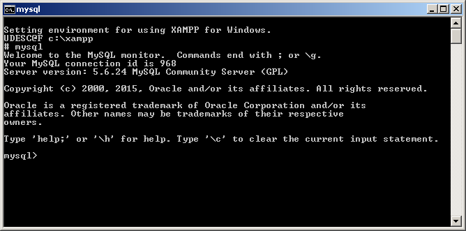
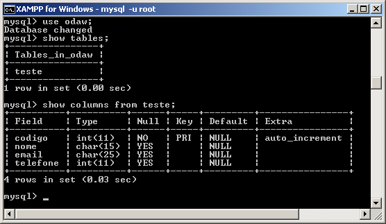
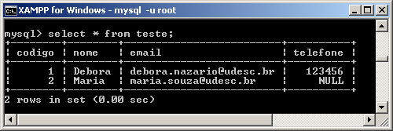

# Banco de Dados MySQL
### Vantagens do MySQL


- Velocidade proporcionada pela sua implementação leve.
- Distribuição gratuita.
- Facilidade de integração com servidor Web.
- Facilidade de integração com linguagens de programação para o desenvolvimento de sites dinâmicos, especialmente a linguagem PHP.

---

### Capacidades e Funcionalidades


- Capacidade de lidar com um número ilimitado de usuários.
- Capacidade de manipular mais de 50 milhões de registros.
- Execução rápida de comandos.
- Sistema de segurança simples e funcional.
- Possui APIs para C, C++, Java, Perl, PHP, Python, TCL.

---

### Características Técnicas


- Foi desenvolvido para várias plataformas incluindo ambientes Unix, OS/2 e Windows.
- Permite operações e funções nas cláusulas `SELECT` e `WHERE`.
- Suporte a funções SQL (`GROUP BY`, `ORDER BY`).
- Além de funções de agregação como: `COUNT()`, `AVG()`, `SUM()`, `STD()`, `MAX()`, `MIN()`.
- Permite a seleção de diferentes tabelas de diferentes bases de dados em uma mesma query.

---

### Segurança e Acesso


- Possui algoritmos de criptografia de senhas, fornecendo assim segurança aos dados gravados nas tabelas.
- Permite conexões via TCP/IP.
- Acesso via terminal.

---

### Estrutura e Sintaxe Básica


- Os comandos são sucedidos por ponto e vírgula (`;`).
- Bancos de dados são estruturas complexas de dados.
- Os dados são gravados em tabelas contendo colunas com tipos definidos.
- Os dados são armazenados em forma de registros.

---

### Tipos de Dados


Suporta uma grande extensão de tipos, incluindo: numéricos, caracteres, caracteres de tamanho variável e tipos enumerados.

- `CHAR(tamanho)`: Caracter de tamanho fixo (de 1 a 255). Usado para caracteres alfanuméricos, como endereços e nomes.
- `VARCHAR(tamanho)`: Aloca apenas o tamanho necessário para a gravação, mas é mais lento que o `CHAR`.
- `INT`: Valor inteiro.
- `FLOAT`: Valor numérico de ponto flutuante.

---

### Tipos de Dados: Data, Tempo e Textos Longos


- `DATE`: Campo de data padrão. O padrão é `AAAA-MM-DD`.
- `TIME`: Campo de tempo padrão.
- `TEXT` / `BLOB`: Utilizados para armazenar uma grande quantidade de informação (de 0 a 65535 bytes).
  - `TEXT`: Não é sensível a maiúsculas e minúsculas (case insensitive).
  - `BLOB`: Sensível a maiúsculas e minúsculas (case sensitive).
- `SET`: Permite ao usuário escolher um determinado número de opções (até 64 opções).
- `ENUM`: Semelhante ao `SET`, mas permite escolher apenas uma opção.

---

### Registros e Tabelas


- **Registros**: Conjunto de campos relacionados. Exemplo de campos que compõem um registro: `nome CHAR(15)`, `email CHAR(25)`, `telefone INT`.
- **Tabelas**: Um conjunto de registros forma uma tabela.

---

### Conexão com o Servidor MySQL



Para conectar com o servidor MySQL, é possível usar o terminal:
- Diretório de instalação no XAMPP: `c:\xampp\mysql\bin\mysql`
- Pelo XAMPP Control Panel: Clicar em "Shell" e digitar `mysql`
- Após a conexão, o prompt exibido será: `mysql>`

---

### Comandos Básicos de Conexão


- **Trocar o banco de dados**:
  ```sql
  USE <nome_bd>;
  ```
  Mensagem de sucesso: `Database changed`

- **Desconectar do servidor MySQL**:
  ```sql
  QUIT;
  ```
  Ou:
  ```sql
  EXIT;
  ```

---

### Comandos de Ajuda e Exibição


- **Ajuda do MySQL**:
  ```sql
  HELP;
  ```
- **Mostrar todas as bases de dados já criadas**:
  ```sql
  SHOW DATABASES;
  ```
- **Mostrar todas as variáveis disponíveis do MySQL**:
  ```sql
  SHOW VARIABLES;
  ```

---

### Comandos de Status e Criação de Banco de Dados


- **Mostrar informações estatísticas da sessão MySQL aberta**:
  ```sql
  SHOW STATUS;
  ```

- **Criar um banco de dados**:
  ```sql
  CREATE DATABASE <nome_bd>;
  ```
  Exemplo de conexão e criação:
  - No Windows: `c:\xampp\mysql\bin>mysql -u root`
  - No Ubuntu: `mysql -h localhost -u root -p`
  - Criando banco no prompt: `mysql> CREATE DATABASE odaw;`

- **Mostrar todas as tabelas do banco de dados em uso**:
  ```sql
  SHOW TABLES;
  ```

---

### Operações Básicas: Criação de Tabelas


As operações básicas (CRUD) incluem: Incluir, Apagar, Alterar e Pesquisar.

- **Criar uma tabela**:
  ```sql
  CREATE TABLE nome_tabela (campo tipo, campo tipo...);
  ```
  Exemplo:
  ```sql
  CREATE TABLE teste (codigo INT, nome CHAR(15), email CHAR(25), telefone INT);
  ```

**Regras para as tabelas**:
- As tabelas do banco devem ter nomes diferentes.
- O nome de uma coluna pode ter até 64 caracteres.
- O nome da coluna pode começar com um número, mas não pode ser composto somente por números.

---

### Estrutura da Tabela e Chave Primária


- **Mostrar a definição (estrutura) de uma tabela**:
  ```sql
  DESCRIBE <nome_tabela>;
  ```

- **Chave Primária (`PRIMARY KEY`)**:
  - Garante um valor único para cada registro da tabela.
  - Exemplo com chave primária em `nome`:
    ```sql
    nome CHAR(15) PRIMARY KEY
    ```
  - Exemplo criando a tabela com a chave primária:
    ```sql
    CREATE TABLE teste (codigo INT, nome CHAR(15) PRIMARY KEY, email CHAR(25), telefone INT);
    ```

---

### Auto Incremento e Visualização de Colunas


- **Auto Incremento (`AUTO_INCREMENT`)**:
  - Soma um (1) ao valor do campo a cada registro inserido de forma automática.
  - Exemplo: `codigo INT AUTO_INCREMENT`
  - Aplicando na criação da tabela:
    ```sql
    CREATE TABLE teste (codigo INT AUTO_INCREMENT PRIMARY KEY, nome CHAR(15), email CHAR(25), telefone INT);
    ```

- **Mostrar colunas e estrutura da tabela**:
  ```sql
  SHOW COLUMNS FROM teste;
  ```
  ou
  ```sql
  DESCRIBE teste;
  ```

---

### Exemplos de Estruturas



---

### Inserindo Registros


- Sintaxe básica para inserção de dados:
  ```sql
  INSERT INTO nome_tabela VALUES (valor1, valor2, ...);
  ```
  Exemplos:
  ```sql
  INSERT INTO teste VALUES (NULL, 'Debora', 'debora.nazario@udesc.br', 123456);
  ```
  ```sql
  INSERT INTO teste (nome, email) VALUES ('Maria', 'maria.souza@udesc.br');
  ```

---

### Sintaxe Completa do Comando INSERT


```sql
INSERT [LOW_PRIORITY | DELAYED] [IGNORE]
       [INTO] tbl_name [(col_name,...)]
       VALUES ((expression | DEFAULT),...),(...),...
       [ ON DUPLICATE KEY UPDATE col_name=expression, ... ]

-- ou

INSERT [LOW_PRIORITY | DELAYED] [IGNORE]
       [INTO] tbl_name [(col_name,...)]
       SELECT ...

-- ou

INSERT [LOW_PRIORITY | DELAYED] [IGNORE]
       [INTO] tbl_name
       SET col_name=(expression | DEFAULT), ...
       [ ON DUPLICATE KEY UPDATE col_name=expression, ... ]
```

---

### Pesquisando Registros



- Listar todos os registros da tabela `teste`:
  ```sql
  SELECT * FROM teste;
  ```

- Listar com condição (cláusula `WHERE`):
  ```sql
  SELECT * FROM teste WHERE (nome = "Debora");
  ```

---

### Sintaxe Completa do Comando SELECT


```sql
SELECT [STRAIGHT_JOIN]
       [SQL_SMALL_RESULT] [SQL_BIG_RESULT] [SQL_BUFFER_RESULT]
       [SQL_CACHE | SQL_NO_CACHE] [SQL_CALC_FOUND_ROWS] [HIGH_PRIORITY]
       [DISTINCT | DISTINCTROW | ALL]
       select_expression,...
       [INTO {OUTFILE | DUMPFILE} 'file_name' export_options]
       [FROM table_references
       [WHERE where_definition]
       [GROUP BY {unsigned_integer | col_name | formula} [ASC | DESC], ...
         [WITH ROLLUP]]
       [HAVING where_definition]
       [ORDER BY {unsigned_integer | col_name | formula} [ASC | DESC] ,...]
       [LIMIT [offset,] row_count | row_count OFFSET offset]
       [PROCEDURE procedure_name(argument_list)]
       [FOR UPDATE | LOCK IN SHARE MODE]]
```

---

### Apagando Registros


- Apagar registro específico:
  ```sql
  DELETE FROM teste WHERE (codigo = 1);
  ```

- Apagar todos os registros da tabela rapidamente:
  ```sql
  TRUNCATE TABLE nome_tabela;
  ```

---

### Sintaxe Completa do Comando DELETE


```sql
DELETE [LOW_PRIORITY] [QUICK] [IGNORE] FROM table_name
       [WHERE where_definition]
       [ORDER BY ...]
       [LIMIT row_count]

-- ou

DELETE [LOW_PRIORITY] [QUICK] [IGNORE] table_name[.*] [, table_name[.*] ...]
       FROM table_references
       [WHERE where_definition]
```

---

### Alterando Registros


Para alterar dados em um ou mais registros existentes:
```sql
UPDATE teste SET nome = 'Debora C Nazario' WHERE nome = 'Debora';
```

---

### Sintaxe Completa do Comando UPDATE


```sql
UPDATE [LOW_PRIORITY] [IGNORE] tbl_name
       SET col_name1=expr1 [, col_name2=expr2 ...]
       [WHERE where_definition]
       [ORDER BY ...]
       [LIMIT row_count]
```

---

### Operadores Lógicos na Pesquisa


- **AND**: Todas as condições devem ser verdadeiras.
  ```sql
  SELECT * FROM teste WHERE (nome = 'Debora' AND email='debora.nazario@udesc.br');
  ```
- **OR**: Pelo menos uma das condições deve ser verdadeira.
  ```sql
  SELECT * FROM teste WHERE (nome = 'Debora' OR email='debora.nazario@udesc.br');
  ```
- **NOT (!)**: Negação de uma condição.
  ```sql
  SELECT * FROM teste WHERE (nome != 'Debora');
  ```

---

### Ordenação e Pesquisa Aproximada (LIKE)


- **ORDER BY**: Ordena as informações por um ou mais campos.
  ```sql
  SELECT * FROM teste ORDER BY nome;
  ```

- **LIKE**: Pesquisa valores "aproximados" com base em curingas.
  - O curinga `%` representa zero, um ou mais caracteres.
  - Começando com um termo: Selecionará todos os nomes que começam com "DE" (ex: DEBORA, DENISE):
    ```sql
    SELECT * FROM teste WHERE nome LIKE 'DE%';
    ```
  - Terminando com um termo: Selecionará todos os nomes que terminam com "RA" (ex: DEBORA, MARA):
    ```sql
    SELECT * FROM teste WHERE nome LIKE '%RA';
    ```
  - Contendo um termo em qualquer posição: Selecionará todos os nomes que tenham "NO" em qualquer lugar (ex: FABIANO, MANOEL, NORMA):
    ```sql
    SELECT * FROM teste WHERE nome LIKE '%NO%';
    ```

---

### Alterar e Apagar Estruturas de Tabelas


- **Apagar uma tabela inteira**:
  ```sql
  DROP TABLE nome_tabela;
  ```
  Exemplo:
  ```sql
  DROP TABLE teste;
  ```

- **Alterar a estrutura de uma tabela**:
  ```sql
  ALTER TABLE nome_tabela ...;
  ```
  Sintaxe genérica:
  ```sql
  ALTER [IGNORE] TABLE tbl_name alter_specification [, alter_specification] ...;
  ```

---

### Sintaxe do Comando ALTER TABLE


Opções para `alter_specification`:
```sql
    ADD [COLUMN] create_definition [FIRST | AFTER column_name ]
  | ADD [COLUMN] (create_definition, create_definition,...)
  | ADD INDEX [index_name] [index_type] (index_col_name,...)
  | ADD [CONSTRAINT [symbol]] PRIMARY KEY [index_type] (index_col_name,...)
  | ADD [CONSTRAINT [symbol]] UNIQUE [index_name] [index_type] (index_col_name,...)
  | ADD FULLTEXT [index_name] (index_col_name,...)
  | ADD [CONSTRAINT [symbol]] FOREIGN KEY [index_name] (index_col_name,...)
           [reference_definition]
  | ALTER [COLUMN] col_name {SET DEFAULT literal | DROP DEFAULT}
  | CHANGE [COLUMN] old_col_name create_definition [FIRST | AFTER column_name]
  | MODIFY [COLUMN] create_definition [FIRST | AFTER column_name]
  | DROP [COLUMN] col_name
  | DROP PRIMARY KEY
  | DROP INDEX index_name
  | DISABLE KEYS
  | ENABLE KEYS
  | RENAME [TO] new_tbl_name
  | ORDER BY col
  | CHARACTER SET character_set_name [COLLATE collation_name]
  | table_options
```

---

### Exemplos de Modificação de Tabelas (ALTER TABLE)


- **Criar a tabela `t1`** com os campos `a` e `b`:
  ```sql
  CREATE TABLE t1 (a INTEGER, b CHAR(10));
  ```
- **Renomear** a tabela `t1` para `t2`:
  ```sql
  ALTER TABLE t1 RENAME t2;
  ```
- **Alterar o tipo** da coluna `a` e o **nome e tipo** da coluna `b`:
  - `a` muda de `INTEGER` para `TINYINT NOT NULL`.
  - `b` muda para `c` e passa de `CHAR(10)` para `CHAR(20)`.
  ```sql
  ALTER TABLE t2 MODIFY a TINYINT NOT NULL, CHANGE b c CHAR(20);
  ```

---

### Mais Exemplos de Modificação de Tabelas


- **Adicionar uma coluna** (`d`):
  ```sql
  ALTER TABLE t2 ADD d TIMESTAMP;
  ```
- **Adicionar índice** em `d` e definir chave primária em `a`:
  ```sql
  ALTER TABLE t2 ADD INDEX (d), ADD PRIMARY KEY (a);
  ```
- **Apagar (remover) a coluna** `c`:
  ```sql
  ALTER TABLE t2 DROP COLUMN c;
  ```

---

### Apagar Banco de Dados e Bibliografia


- **Apagar o banco de dados inteiro**:
  ```sql
  DROP DATABASE nome_base;
  ```

**Bibliografia**:
- [www.mysql.com](https://www.mysql.com)

---

### Exercícios Práticos


1. Criar uma base de dados.
2. Criar pelo menos uma tabela com pelo menos 3 campos.
3. Executar comandos para:
   - Inserir dados
   - Alterar dados
   - Visualizar dados
   - Apagar dados
4. Apagar a tabela.
5. Apagar a base de dados.
