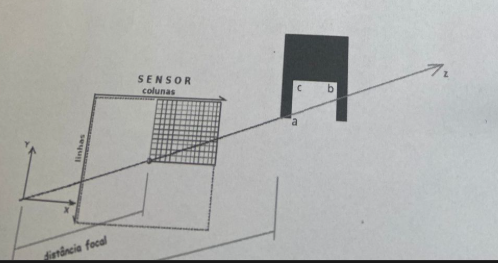

**Notas:** Essa prova menciona figuras, salvei elas a título de estudo.

**Questão 1**

1. Faça o envio do documento manuscrito através do Moodle até as 18h00 do dia 26/04. Um indivíduo possui duas fotografias digitais da fachada da casa de seu bisavô, capturadas no verão a partir do mesmo ponto de vista. Ambas possuem as mesmas dimensões, câmera e enquadramento. A primeira foto é datada de 01/01/1937 e a segunda de 31/12/1937. Essa pessoa deseja gerar uma imagem que simule a fachada em uma data específica dentro desse período. Explique de forma detalhada como a técnica de *cross-fading* pode ser utilizada para resolver o problema, empregando uma escala válida baseada na contagem de dias decorridos. Apresente sua solução com textos, desenhos ou pseudocódigos.
Observações:

* Abril, junho, setembro e novembro possuem 30 dias;
* Janeiro, março, maio, julho, agosto, outubro e dezembro possuem 31 dias;
* Fevereiro possui 28 dias;
* 1937 não foi um ano bissexto.

---

**Questão 2**

2. A matriz apresentada abaixo utiliza o padrão de filtro Bayer. Descreva as fórmulas matemáticas empregadas para a interpolação (baseando-se na média dos vizinhos) e calcule os valores dos canais RGB para a região compreendida entre as linhas 1 a 3 e colunas 1 a 3.

|  | 0 | 1 | 2 | 3 | 4 |
| --- | --- | --- | --- | --- | --- |
| **0** | 120 (R) | 150 (G) | 120 (R) | 150 (G) | 120 (R) |
| **1** | 150 (G) | 120 (B) | 240 (G) | 120 (B) | 150 (G) |
| **2** | 120 (R) | 240 (G) | 120 (R) | 240 (G) | 120 (R) |
| **3** | 150 (G) | 120 (B) | 240 (G) | 120 (B) | 150 (G) |
| **4** | 120 (R) | 150 (G) | 120 (R) | 150 (G) | 120 (R) |

**Resposta Corrigida (Matrizes para as linhas/colunas 1 a 3):**

$$\color{red}{R = \begin{bmatrix} 120 & 120 & 120 \\ 120 & 120 & 120 \\ 120 & 120 & 120 \end{bmatrix} \quad G = \begin{bmatrix} 195 & 240 & 195 \\ 240 & 240 & 240 \\ 195 & 240 & 195 \end{bmatrix} \quad B = \begin{bmatrix} 120 & 120 & 120 \\ 120 & 120 & 120 \\ 120 & 120 & 120 \end{bmatrix}}$$

---

**Questão 3**

3. Utilizando os canais RGB resultantes da questão anterior, realize a conversão da imagem para tons de cinza. Apresente a expressão matemática utilizada na conversão e os valores numéricos da matriz de saída.

Matrizes RGB de entrada:

$$R = \begin{bmatrix} 120 & 120 & 120 \\ 120 & 120 & 120 \\ 120 & 120 & 120 \end{bmatrix} \quad G = \begin{bmatrix} 195 & 240 & 195 \\ 240 & 240 & 240 \\ 195 & 240 & 195 \end{bmatrix} \quad B = \begin{bmatrix} 120 & 120 & 120 \\ 120 & 120 & 120 \\ 120 & 120 & 120 \end{bmatrix}$$

**Resposta Corrigida (Matriz em tons de cinza):**

$$\color{red}{\text{Tons de cinza} = \begin{bmatrix} 145 & 160 & 145 \\ 160 & 160 & 160 \\ 145 & 160 & 145 \end{bmatrix}}$$

---

**Questão 4**

4. A partir da imagem em tons de cinza gerada na questão 3, aplique o algoritmo Isodata para encontrar um limiar (L) e binarizar a matriz. Escreva o pseudocódigo do algoritmo Isodata e do processo de limiarização, e exiba os valores finais da matriz binária.

**Resposta Corrigida (Matriz binária de saída):**

$$\color{red}{\text{Binária de saída} = \begin{bmatrix} 0 & 1 & 0 \\ 1 & 1 & 1 \\ 0 & 1 & 0 \end{bmatrix}}$$

---

**Questão 5**

5. Considere um modelo de câmera *pinhole* (conforme o esquema da Figura 1) com os seguintes parâmetros definidos:

* Distância focal $d$ igual a 10 mm e pixels quadrados com lado medindo 0,1 mm;
* O sensor é do tipo binário: um pixel é registrado como aceso (preto) se um ou mais raios incidirem sobre ele, caso contrário, permanece apagado (branco);
* Coordenadas centrais do sensor: $O_x = O_y = 4096$ pixels.

A matriz de projeção é descrita pela Equação 1:

$$M_{projecao} = \begin{pmatrix} 1 & 0 & 0 \\ 0 & 1 & 0 \\ 0 & 0 & 1/d \end{pmatrix}$$

Um aplicativo fará a análise da imagem para identificar uma reentrância em um objeto. As coordenadas 3D dos pontos de interesse (a, b e c) da peça estão descritas na Tabela 1 em milímetros:

| Ponto | X | Y | Z |
| --- | --- | --- | --- |
| **a** | 10,24 | 10,24 | 10,0 |
| **b** | 10,25 | 10,25 | 10,0 |
| **c** | 10,24 | 10,25 | 10,0 |

Com base nestas informações, responda às questões a seguir apresentando cálculos claros e justificativas fundamentadas.
*Lembre-se de truncar as coordenadas de pixel para valores inteiros (ex: 3333,9 torna-se 3333).*

A) Utilize a matriz da Eq. 1 para calcular as coordenadas em pixels das projeções dos pontos a, b e c no sensor.
B) Com a configuração atual da câmera, será possível realizar uma análise automatizada satisfatória dos detalhes da peça? Existe separação suficiente entre as regiões que formam a reentrância?
C) Suponha que o sensor original quebrou e foram oferecidas três alternativas para reposição. Levando em consideração o objetivo de analisar a peça, avalie as opções abaixo e escolha a mais adequada justificando sua decisão:

* **Sensor 1:** Possui o mesmo tamanho de pixel do original, mas com o quádruplo da área total.
* **Sensor 2:** Mantém as mesmas dimensões gerais da questão, mas cada pixel é um quadrado de 0,01 mm de lado.
* **Sensor 3:** Mantém as mesmas dimensões gerais da questão, mas cada pixel é um quadrado de 0,11 mm de lado.

