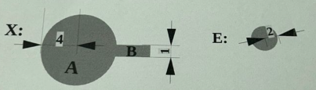
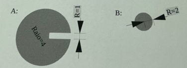

**Notas:** Essa prova menciona figuras, salvei elas a título de estudo. 

**Questão 1**

1. Anexe a questão antecipada ou responda de forma manuscrita à seguinte pergunta (baseada na 13ª questão da lista de exercícios de processamento morfológico): Descreva, utilizando ilustrações como apoio, como o método morfológico "top-hat" é aplicado no pré-processamento de imagens em tons de cinza que possuem iluminação irregular, antes de serem submetidas a um processo de limiarização.

---

**Questão 2**

2. Detalhe a base conceitual e explique sua aplicação na construção do operador gradiente (referente à tarefa #2).

---

**Questão 3**

3. Classifique as sentenças abaixo como Verdadeiras (V) ou Falsas (F). Atenção: uma resposta incorreta anula uma resposta correta, portanto, assinale apenas se tiver convicção.

a) Dado um mesmo elemento estruturante $B$, a operação de erosão desfaz completamente uma dilatação: $A=ero(dil(A,B),B)$. Da mesma forma, uma dilatação desfaz completamente uma erosão: $A=dil(ero(A,B),B)$.
( )

b) A utilização de operadores morfológicos é restrita exclusivamente a imagens binárias.
( )

c) Considere um elemento estruturante $E$ em formato de disco (com centro na origem) e um objeto $X$ formado por uma circunferência $A$ e uma protuberância $B$. A operação $dil(ero(X,E))$ praticamente elimina a protuberância do objeto $X$ sem causar perdas significativas na área da circunferência $A$.
( )

d) Considere um elemento estruturante $E$ em forma de disco (centrado na origem) e um objeto $X$ composto por uma circunferência $A$ com uma reentrância $B$. A operação $ero(dil(X,E))$ preenche quase que totalmente a reentrância de $X$ sem causar um aumento significativo na área da circunferência $A$.
( )

e) A imagem $C$, gerada pela dilatação em tons de cinza de uma imagem $A$ com um elemento estruturante $B$, é definida por $C = [dil_{gray}(A,B)](l,c) = \max\{A(l-m,c-n)\}$. É correto afirmar que essa dilatação em tons de cinza resulta em um espalhamento de áreas escuras sobre as áreas claras.
( )

f) A imagem $D$, obtida pela erosão em tons de cinza de uma imagem $A$ usando um elemento estruturante $B$, é dada por $D = [ero_{gray}(A,B)](l,c) = \min\{A(l-m,c-n)\}$. É correto afirmar que a erosão em tons de cinza resulta em um espalhamento de áreas claras sobre as áreas escuras.
( )
