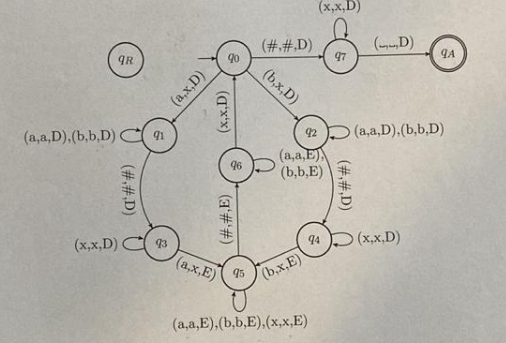

**Notas:** Essa prova menciona figuras, salvei elas a título de estudo.

**Questão 1**

Responda aos itens abaixo com base na seguinte Máquina de Turing:
$M = (\{q_0, q_1, \dots, q_7, q_A, q_R\}, \{\#, a, b\}, \{\#, a, b, x, \_\}, \delta, q_0, q_A, q_R)$
Onde a função de transição $\delta$ é dada pelo diagrama de estados da prova.

a) Qual é a linguagem reconhecida por essa máquina $M$?
b) A cadeia $\#xxx$ faz parte de $L(M)$? Justifique seu raciocínio.
c) A máquina $M$ é considerada uma decisora? Se a resposta for positiva, seria viável construir uma Máquina de Turing equivalente que não atue como decisora? Explique o porquê.

---

**Questão 2**

Ao realizar a simulação de uma Máquina de Turing Não Determinista através de uma Máquina de Turing Determinista, qual é a razão para não utilizarmos uma estratégia de busca em profundidade na árvore das computações possíveis da máquina não determinista?

---

**Questão 3**

Considerando um conjunto de palavras $X$, define-se a operação de reversão de $X$, representada por $X^R$, como o conjunto:
$X^R = \{w^R \mid w \in X\}$
Sendo $w^R$ a palavra $w$ escrita de trás para frente. Por exemplo, se $w = abcd$, teremos $w^R = dcba$.
A classe que engloba as linguagens reconhecíveis é fechada para essa operação de reversão? Apresente argumentos para justificar ou refutar essa afirmação.

---

**Questão 4**

Considere $\alpha$ como o modelo tradicional de Máquina de Turing de Sipser, porém com a adição de um movimento estacionário. Isso significa que a máquina $\alpha$ é descrita por uma 7-upla $(Q_\alpha, \Sigma_\alpha, \Gamma_\alpha, \delta_\alpha, q_{0\alpha}, q_{A\alpha}, q_{R\alpha})$, possuindo a função de transição $\delta_\alpha: Q_\alpha \times \Gamma_\alpha \to Q_\alpha \times \Gamma_\alpha \times \{E, D, P\}$.

Defina $\beta$ como um outro modelo de Máquina de Turing estruturado por uma 6-upla $(Q_\beta, \Sigma_\beta, \Gamma_\beta, \delta_\beta, q_{0\beta}, F_\beta)$, cuja função de transição é $\delta_\beta: Q_\beta \times \Gamma_\beta \to Q_\beta \times \Gamma_\beta \times \{E, D, P\}$.

Uma máquina do tipo $\beta$ utiliza uma fita semi-infinita estendida para a direita. O posicionamento inicial da palavra na fita é idêntico ao da máquina $\alpha$, e seu processamento ocorre por meio da aplicação contínua de $\delta_\beta$ até atingir uma condição de parada.
O critério de parada de uma máquina $\beta$ é ativado quando ela tenta realizar um movimento para a esquerda estando com o cabeçote na primeira célula (a mais à esquerda) da fita. Se esse evento ocorrer enquanto a máquina estiver em um estado que pertence ao conjunto $F_\beta$, a palavra de entrada é aceita. Se ocorrer em um estado fora de $F_\beta$, a palavra é rejeitada.

Com base nisso, prove que os modelos $\alpha$ e $\beta$ possuem equivalência computacional.